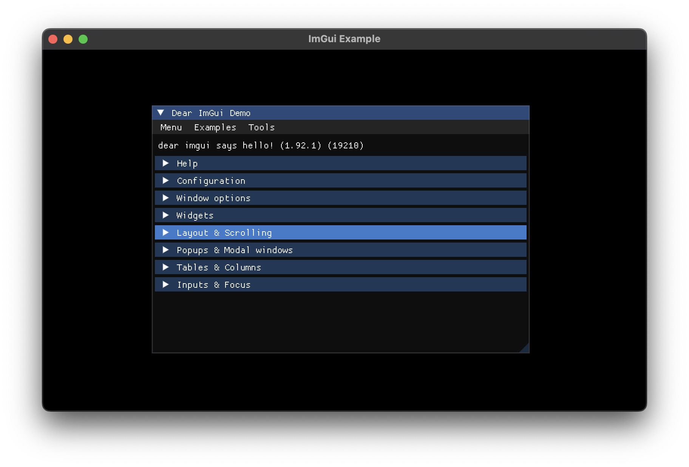

# C++20 Module Binding for ImGui

[](https://opensource.org/licenses/MIT)

Use ImGui with `import imgui;`. This binding is generated with [cimgui](https://github.com/cimgui/cimgui?tab=readme-ov-file) and regularly updated and tested with [GitHub Actions](.github/workflows/generate-and-build.yml).

## Usage

### Using with Latest ImGui ([v1.92.6](https://github.com/ocornut/imgui/releases/tag/v1.92.6))

This repository already contains the generated bindings for the latest ImGui version.

- [`imgui.cppm`](generated/imgui.cppm): exports all symbols in [`imgui.h`](https://github.com/ocornut/imgui/blob/master/imgui.h), can be used as `import imgui;`.
- [`imgui_internal.cppm`](generated/imgui_internal.cppm): exports all symbols in [`imgui_internal.h`](https://github.com/ocornut/imgui/blob/master/imgui_internal.h), can be used as `import imgui_internal;`. It implicitly exports `imgui` module, therefore you don't have to import `imgui` separately.
- [`imgui_freetype.cppm`](generated/imgui_freetype.cppm): exports all symbols in [`imgui_freetype.h`](https://github.com/ocornut/imgui/blob/master/misc/freetype/imgui_freetype.h), can be used as `import imgui_freetype;`. It implicitly exports `imgui` module.

And following backends are also available:

- [`imgui_impl_glfw.cppm`](generated/backends/imgui_impl_glfw.cppm): can be used as `import imgui_impl_glfw;`.
- [`imgui_impl_opengl2.cppm`](generated/backends/imgui_impl_opengl2.cppm): can be used as `import imgui_impl_opengl2;`.
- [`imgui_impl_opengl3.cppm`](generated/backends/imgui_impl_opengl3.cppm): can be used as `import imgui_impl_opengl3;`.
- [`imgui_impl_sdl2.cppm`](generated/backends/imgui_impl_sdl2.cppm): can be used as `import imgui_impl_sdl2;`.
- [`imgui_impl_sdl3.cppm`](generated/backends/imgui_impl_sdl3.cppm): can be used as `import imgui_impl_sdl3;`.
- [`imgui_impl_vulkan.cppm`](generated/backends/imgui_impl_vulkan.cppm): can be used as `import imgui_impl_vulkan;`.

### Using with Older ImGui Versions / Features / Backends

If you want to use ImGui with an older version, different feature configuration or a custom backend, you can generate the bindings yourself. The following steps will guide you through the process:

1. Cone the repository with recursive submodules:

  ```sh
  git clone --recurse-submodules https://github.com/stripe2933/imgui-module.git
  cd imgui-module
  ```

2. Checkout the ImGui version you want to use: in [`cimgui/imgui`](cimgui/imgui) submodule folder, checkout the desired version tag or commit.
3. Manipulate the `cimgui` configuration, explained in [cimgui - Using Generator](https://github.com/cimgui/cimgui?tab=readme-ov-file#using-generator). This will generate `definitions.json`, `structs_and_enums.json` and `impl_definitions.json` files in [`cimgui/generator/output`](cimgui/generator/output) folder.
4. Run the Python generator script:
  
  ```sh
  python3 generate.py
  ```

5. The generated bindings will be in the [`generated`](generated) folder. You can use them as described in the previous section.

## Examples



This repository contains several examples for how to integrate these generated module bindings with different backends. These examples are also used for build testing with [GitHub Actions](.github/workflows/generate-and-build.yml).

Currently, following examples are available:

- [GLFW + Vulkan](examples/glfw_vulkan): it also uses [Vulkan-Hpp C++20 module](https://github.com/KhronosGroup/Vulkan-Hpp/blob/main/README.md#c20-named-module-).

Contributions for more examples are welcome!

### Using Installed Libraries

To build these examples, you need:

- CMake ≥ 3.30 for MSVC or Clang, ≥ 4.0 for GCC.
- Ninja ≥ 1.11
- A C++23 compliant compiler
  - GCC 15 or later
  - Clang 18 or later
  - Microsoft Visual Studio 2022 or later

Configure CMake with the following command:

```sh
cd examples
cmake --preset=default
```

then, by the library installation status on your system, the available targets will be configured. For example, if your system has GLFW installed and unless you're using macOS without Vulkan SDK, `glfw_vulkan` target will be available. You can build the example with:

```sh
cmake --build build --target glfw_vulkan
```

And the executable will be in `examples/build` folder.

### Using vcpkg

If you want to build all examples regardless of the installed libraries, you can use vcpkg to install the used libraries. Configuring CMake with the following command:

```sh
cmake --preset=default -DCMAKE_TOOLCHAIN_FILE=<path-to-vcpkg>/scripts/buildsystems/vcpkg.cmake
```

will install all required libraries and enable the examples.

# License

This project is licensed under the MIT License. See the [LICENSE](LICENSE.txt) file for details.
